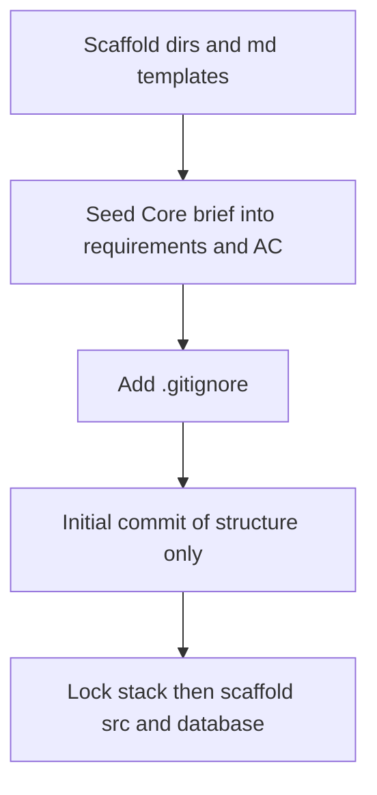

# Repository Initialization (Pre-Stack / Pre-Requirements Lock)

> Archived from Cursor plan `repo_init_scaffold_a94309dc` on 2026-07-25.

Initialize against the PDF’s **Required Repository Structure**. Create documentation skeletons and empty app folders now; defer stack-specific files (`package.json`, `requirements.txt`, ORM configs, etc.) until the stack and Core requirements are locked.

## Scope: Core only

**Stretch / optional work is out of scope** for this assessment and must not appear in the scaffold, requirements, acceptance criteria, design notes, or implementation plan as planned work. Explicitly exclude:

- Richer data model beyond User / Ticket / Comment
- Full user CRUD and role-management UI
- Authentication, protected routes, API authorization
- Swagger / OpenAPI
- Docker setup
- Reusable prompt templates / rules / specs as Stretch deliverables (normal `ai-prompts/` history for Core still required)

In seeded docs (`requirements-analysis.md`, `acceptance-criteria.md`, `implementation-plan.md`), state that Stretch is deliberately excluded so scope stays focused on the mandatory Core.

## What to create now

### Root documentation — use PDF Submission Templates for structure

Create each file at repo root using the **exact section headers** from the PDF “Submission Templates” (floor, not limit). Leave body content empty or `TBD` except where Core brief facts are seeded later. Do not invent extra top-level sections beyond what the templates (or Part A list) define.

#### `candidate-info.md`

```markdown
# Candidate Information
Name:
Role:
Primary Technology Stack: TBD
Primary AI Tool Used: Cursor
Project Option Selected: Support Ticket Management System (Core only)
Assessment Start Date:
Submission Date:
## Project Summary
## Tools Used
## Setup Summary
```

#### `requirements-analysis.md`

```markdown
# Requirement Analysis
## Selected Project Option
## My Understanding (in your own words)
## Functional Requirements
## Non-Functional Requirements
## Assumptions
## Clarifications (questions for a product owner)
## Edge Cases
```

#### `acceptance-criteria.md`

```markdown
# Acceptance Criteria
## Core
- [ ] ...
## Validation
- [ ] ...
## Error Handling
- [ ] ...
## Testing
- [ ] ...
## Documentation
- [ ] ...
```

(No Stretch section — out of scope.)

#### `implementation-plan.md`

```markdown
# Implementation Plan
## Overview
## Task Breakdown
## Milestones
## AI Usage Plan
## Risks
## Mitigation
```

#### `design-notes.md`

```markdown
# Design Notes
## Architecture Overview (frontend, backend, database)
## Frontend Design
## Backend Design
## Database Design
## Validation Strategy
## Error Handling Strategy
## Testing Strategy Link
```

#### `api-contract.md`

Repeat this block per endpoint (paths/shapes TBD until stack lock):

```markdown
# API Contract
## Endpoint
- Method:
- Path:
- Purpose:
### Request
### Response
### Validation Rules
### Error Responses
```

#### `test-strategy.md`

```markdown
# Test Strategy
## Test Scope
## Unit Tests
## Component Tests
## API / Integration Tests
## Edge Case Tests
## Tests Not Covered (and why)
```

(Call out mandatory state-machine integration tests under API / Integration Tests.)

#### `debugging-notes.md`

```markdown
# Debugging Notes
## Issue 1
### Problem
### How I Investigated
### How AI Helped
### What I Validated
### Final Fix
```

#### `code-review-notes.md`

```markdown
# Code Review Notes
## AI-Assisted Review Summary
## My Review Observations
## Changes Made After Review
## Suggestions Rejected (and why)
```

#### `reflection.md`

```markdown
# Reflection
## What I Built
## How I Used AI (across the lifecycle)
## What AI Helped With Most
## What AI Got Wrong
## How I Validated AI Output
## What I Would Improve Next
## Reusable Workflow (prompts, rules, specs, templates)
```

#### `pr-description.md`

```markdown
# PR Description
## Summary
## Features Implemented
## Technical Changes
## Database Changes
## Testing Done
## AI Usage Summary
## Screenshots / Demo Notes
## Known Limitations
## Future Improvements
```

### Files in Required Structure without a named Submission Template

Use the PDF’s Part A / repo-structure intent; keep sections minimal and consistent with the template style:

| File | Section structure |
|------|-------------------|
| [README.md](README.md) | `# Support Ticket Management System` → `## Overview` → `## Tech Stack` (TBD) → `## Setup` (TBD) → `## Running Tests` (TBD) |
| [tool-workflow.md](tool-workflow.md) | Part A’s 11 numbered topics as `##` headings (primary tool, context, requirements, planning, generation, validation, testing, debugging, review, what not to share, reuse) |
| [data-model.md](data-model.md) | `# Data Model` → `## User` → `## Ticket` → `## Comment` → `## Relationships` → `## Status State Machine` |
| [ui-flow.md](ui-flow.md) | `# UI Flow` → `## Screens` → `## Ticket Lifecycle` → `## Error States` → `## CSV Export` |
| [test-results.md](test-results.md) | `# Test Results` → `## Summary` → `## Runs` (fill after tests) |
| [review-fixes.md](review-fixes.md) | `# Review Fixes` → `## Fix 1` → `### Finding` / `### Change` / `### Validation` |
| [final-ai-usage-summary.md](final-ai-usage-summary.md) | `# Final AI Usage Summary` → `## Across the Lifecycle` → `## Key Prompts` → `## Judgments and Corrections` |

**Note:** Common req #12 mentions an `/artifacts` folder, but the explicit structure puts these docs at the **root**. Prefer root layout to match the submission tree; do not duplicate under `/artifacts` unless a mentor asks later.

### Prompt history + Cursor tooling

Per PDF Prompt History Expectations, group under `ai-prompts/` by activity:

```
ai-prompts/
  planning.md
  design.md
  implementation.md
  testing.md
  debugging.md
  code-review.md
  documentation.md
tool-specific/
  cursor-workflow/
    .gitkeep
```

Each `ai-prompts/*.md` entry uses this structure (from the PDF):

```markdown
## Entry N — <date or topic>
### Prompt (text or summary)
### AI response summary
### Accepted
### Changed
### Rejected (and why)
```

### Application placeholders (empty until stack is chosen)

```
src/
tests/
database/
  schema-or-migrations/
  seed-data/
  setup-notes.md
```

Use `.gitkeep` in empty dirs so Git tracks them. `database/setup-notes.md` stays a short stub until RDBMS choice.

### Repo hygiene (stack-agnostic)

- [.gitignore](.gitignore) — ignore `.env`, IDE junk, `node_modules/`, `__pycache__/`, `.venv/`, OS files. Do **not** commit secrets (Core acceptance #9).
- `.env.example` waits until stack lock.

## What not to create yet (and what stays out forever for this submission)

Do **not** invent stack lock-in files until tech is decided:

- Frontend: `package.json`, Vite/Next configs, component trees
- Backend: `requirements.txt` / `pyproject.toml`, FastAPI/Django app skeleton
- DB: concrete migration dialects

Do **not** scaffold Stretch at any point (out of scope):

- Docker Compose / Dockerfile
- Auth scaffolding
- OpenAPI / Swagger
- User-management UI beyond seeded users

You can still pre-seed **Core product-facing** content that is already fixed in the PDF (entities, status transitions, Core features, CSV export, mandatory state-machine tests, one search/filter) inside `requirements-analysis.md`, `acceptance-criteria.md`, `data-model.md`, and `ui-flow.md`—framed as “from brief,” with open clarifications listed separately.

## Suggested init order



1. Create folders + markdown files using the PDF Submission Template section headers (and Part A headings for `tool-workflow.md`).
2. Under those sections only, seed Core domain facts (User/Ticket/Comment, state machine, Core features); mark stack and open product questions as TBD; note Stretch out of scope.
3. Add `.gitignore`.
4. Single initial commit: “chore: scaffold assessment repository structure”.
5. After stack + requirements lock: generate `src/`, real migrations, seeds, and tests with Cursor (per Base Rule: AI-generated files).

## Minimal file tree after init

```
ai-practical-assessment/
├── README.md
├── candidate-info.md
├── tool-workflow.md
├── requirements-analysis.md
├── acceptance-criteria.md
├── implementation-plan.md
├── design-notes.md
├── api-contract.md
├── data-model.md
├── ui-flow.md
├── test-strategy.md
├── test-results.md
├── debugging-notes.md
├── code-review-notes.md
├── review-fixes.md
├── pr-description.md
├── reflection.md
├── final-ai-usage-summary.md
├── .gitignore
├── ai-prompts/
│   ├── planning.md
│   ├── design.md
│   ├── implementation.md
│   ├── testing.md
│   ├── debugging.md
│   ├── code-review.md
│   └── documentation.md
├── tool-specific/
│   └── cursor-workflow/
├── src/
├── tests/
└── database/
    ├── schema-or-migrations/
    ├── seed-data/
    └── setup-notes.md
```

## Default choices for this init

- Docs live at **repo root** (per Required Repository Structure).
- Markdown section structure follows **Submission Templates** exactly where the PDF defines them; remaining required files use minimal matching headers.
- `src/` stays a single placeholder until stack split (e.g. `frontend/` + `backend/`) is decided.
- Stretch is permanently out of scope — no Docker, OpenAPI, auth, or user-CRUD files at init or later.
- Keep `ai_assessment_plan.pdf` out of the committed tree unless you explicitly want the brief in-repo; prefer linking or keeping it local so the submission tree stays clean.
